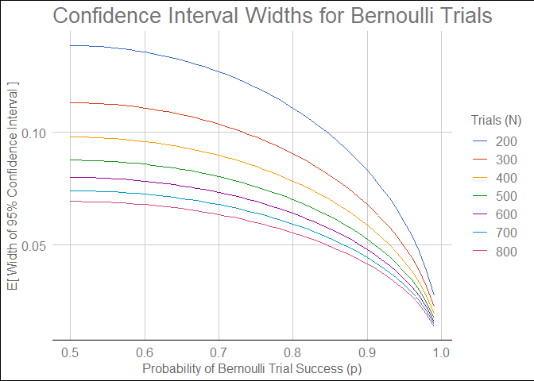
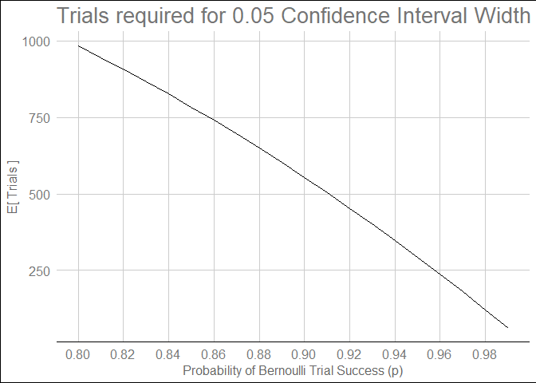

Introduction
------------

The following is an analysis of confidence interval sizes for Bernoulli
Trials. In particular:

*How does the width of a 95% confidence interval narrow as the number of
trials increases?*

The goal is to inform decisions choosing a number of trials *N*, such
that *N* is not *unnecessarily large*, while large enough to give
appropriate *confidence* in estimates resulting from the trials.

Results
-------

The width of the confidence interval is computed as follows:

$w = f(p, N) = 2z \\: \\frac{\\sqrt{p(1-p)}}{\\sqrt{N}} \\quad , \\quad z = 1.96$

### General Trends

The following shows the expected width of a 95% Confidence Interval,
given the probability of success *p*, and the number of trials performed
*N*.

### Intersection with *w* = 0.05

The following shows the number of trials (*N*) required to narrow the
Confidence Interval width to below 0.05, for a given probability *p*. In
other words, it shows how the lines in the plot above intersect with
*y* = 0.05.

